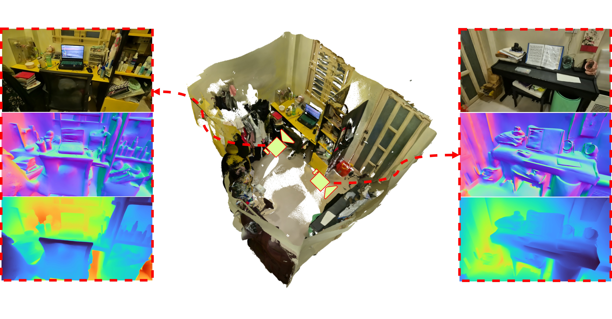
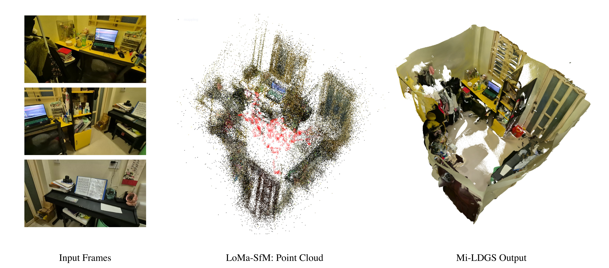
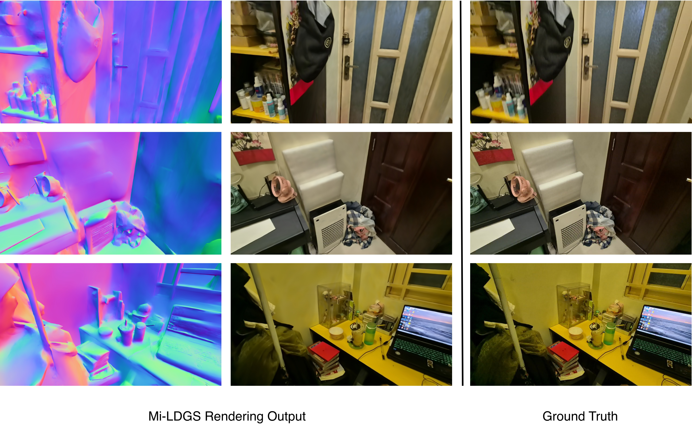

# Mi-LDGS: Monocular Indoor 3D Reconstruction via Gaussian Splatting

**Authors:** [Xuan-Huong Nguyen](https://github.com/nauxqouh), [Phan Thi Ngoc Linh](https://github.com/nlinhpt) | **Advisor:** [MSc. Doan Thi Tram](https://github.com/dtseedx)



## [Project page]() | [Video]() | [Code](https://github.com/nauxqouh/Mi-LDGS.git) <br>

This repo contains the official implementation for our **Bachelor's Graduation Thesis in Data Science "Monocular Indoor 3D Reconstruction via Gaussian Splatting"**. Our work overcomes monocular indoor 3D reconstruction bottlenecks by replacing traditional handcrafted features with an advanced deep-learning pipeline during the Structure-from-Motion (SfM) phase , and integrating a scale-aligned monocular depth prior as a strict geometric constraint during 2D Gaussian Splatting (2DGS) optimization.


## ⭐ Overview

<p align="center">

</p>

**Mi-LDGS** seamlessly integrates deep local features and monocular geometry priors within 2D Gaussian Splatting to form a robust indoor reconstruction cycle.
    
(a) We leverage the end-to-end deep feature architecture of LoMa (DaD Detector + DeDoDe Descriptor + LightGlue Matcher) into the incremental SfM pipeline of COLMAP. This boosts the average image registration rate  and increases 3D point density over standard configurations.
    
(b) We extract relative depth maps using Depth Anything V2 and lineally calibrate them into the SfM metric space using robust statistical estimators, preventing outlier errors.
    
(c) We optimize the 2D Gaussian disk primitives using a global composite loss function across an inverse depth space. The optimized radiant fields are then fused through TSDF Fusion to extract smooth, watertight meshes.



## Setup

Clone the repository

```bash
# download
git clone https://github.com/nauxqouh/Mi-LDGS.git --recursive
cd Mi-LDGS
```

The code has been verified on Ubuntu 22.04 LTS with Python 3.10 and CUDA 12.1. We recommend using a clean Conda environment:

```bash
conda create -n mildgs python=3.10 -y
conda activate mildgs

# install PyTorch and CUDA toolkit
pip install torch==2.1.2 torchvision==0.16.2 --index-url [https://download.pytorch.org/whl/cu121](https://download.pytorch.org/whl/cu121)

# install required geometry and systems extensions
pip install open3d trimesh scipy ninja
pip install -r requirements.txt
```

Manually install the localized CUDA extensions required for differentiable rasterization:

```bash
pip install submodules/simple-knn
pip install submodules/diff-gaussian-rasterization
```

## Training

To train a scene, simply use
```bash
python train.py -s <path to COLMAP or NeRF Synthetic dataset>
```

## Testing

To export a mesh within a bounded volume, simply use
```bash
python render.py -m <path to pre-trained model> -s <path to COLMAP dataset> 
```
Commandline arguments you should adjust accordingly for meshing for bounded TSDF fusion, use
```bash
--depth_ratio # 0 for mean depth and 1 for median depth
--voxel_size # voxel size
--depth_trunc # depth truncation
```
If these arguments are not specified, the script will automatically estimate them using the camera information.

## Benchmark Results

To rigorously evaluate the quantitative performance and individual contributions of each core module, we conduct comprehensive benchmarks and an ablation study on the ScanNet dataset. We evaluate our complete framework (**Mi-LDGS**) against the original 2DGS baseline and its component-wise variations (*w/o LoMa* and *w/o Depth*). 

The experimental results demonstrate that our proposed methods achieve a superior balance between novel view rendering fidelity and watertight surface topology:

| Method | PSNR ↑ | SSIM ↑ | LPIPS ↓ | Acc. ↓ | Comp. ↓ | Prec. ↑ | Recall ↑ | F-score ↑ |
| :--- | :---: | :---: | :---: | :---: | :---: | :---: | :---: | :---: |
| 2DGS *(Baseline)* | 22.878 | 0.805 | 0.343 | 0.094 | 0.187 | 0.504 | 0.380 | 0.426 |
| **Mi-LDGS** *(Ours)* | **24.599** | **0.857** | 0.334 | 0.092 | **0.096** | 0.508 | **0.491** | **0.488** |
| Mi-LDGS *w/o LoMa* | 23.410 | 0.818 | **0.331** | **0.056** | 0.159 | **0.642** | 0.481 | **0.541** |
| Mi-LDGS *w/o Depth* | 23.635 | 0.842 | 0.349 | 0.121 | 0.115 | 0.412 | 0.410 | 0.403 |


## Demo Results

To verify the practical applicability and robustness of **Mi-LDGS** in unconstrained real-world environments, we tested our framework on a self-recorded dataset. This sequence was captured using a standard smartphone camera (**Samsung Galaxy S24**) in a narrow, highly cluttered room containing everyday objects (desks, pianos, bookshelves) and large textureless wall surfaces under complex ambient lighting. 




<!-- We provide <a> Evaluation Results (Pretrained, Meshes)</a>. 
<details>
<summary><span style="font-weight: bold;">Table Results</span></summary>

Chamfer distance on DTU dataset (lower is better)

|   | 24   | 37   | 40   | 55   | 63   | 65   | 69   | 83   | 97   | 105  | 106  | 110  | 114  | 118  | 122  | Mean |
|----------|------|------|------|------|------|------|------|------|------|------|------|------|------|------|------|------|
| Paper    | 0.48 | 0.91 | 0.39 | 0.39 | 1.01 | 0.83 | 0.81 | 1.36 | 1.27 | 0.76 | 0.70 | 1.40 | 0.40 | 0.76 | 0.52 | 0.80 |
| Reproduce | 0.46 | 0.80 | 0.33 | 0.37 | 0.95 | 0.86 | 0.80 | 1.25 | 1.24 | 0.67 | 0.67 | 1.24 | 0.39 | 0.64 | 0.47 | 0.74 |
</details> -->

## Acknowledgements
This project is built upon [2DGS](https://github.com/hbb1/2d-gaussian-splatting). The Monocular Depth Estimation for generating depth prior is built upon [Depth Anỵthing V2](https://github.com/DepthAnything/Depth-Anything-V2). For providing the hierarchical localization and deep local feature matching frameworks [HLoc](https://github.com/cvg/Hierarchical-Localization). We thank all the authors for their great repos. 


